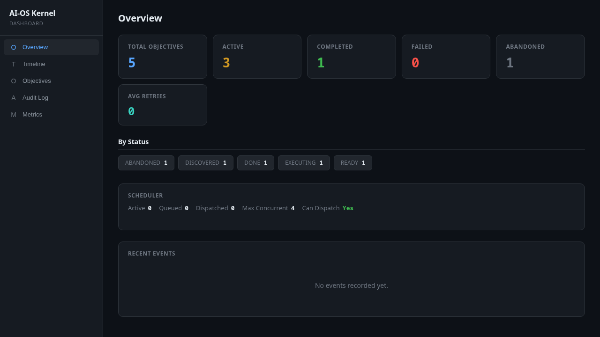
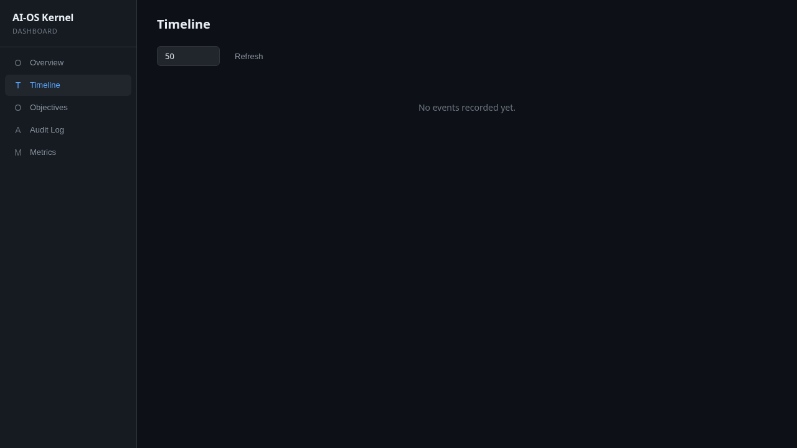
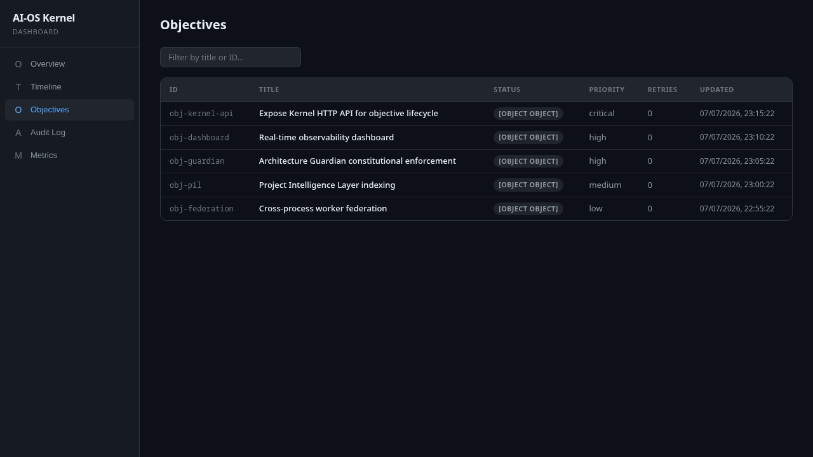
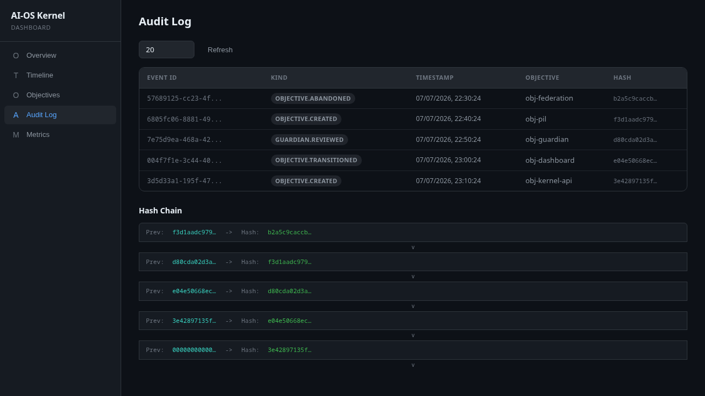
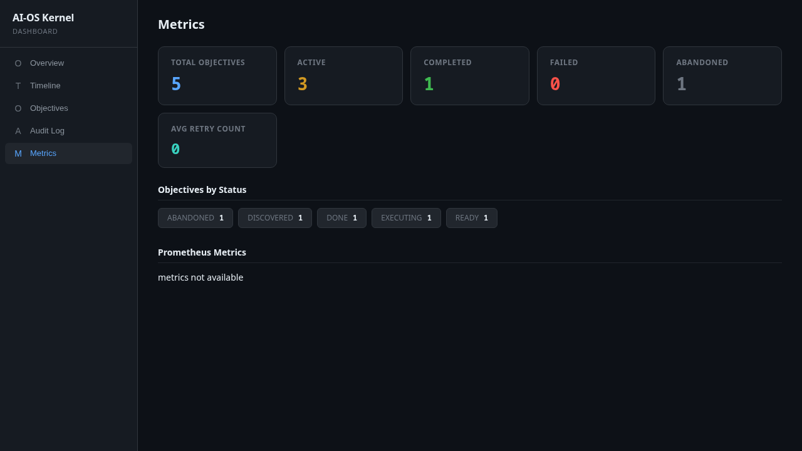

<div align="center">

# AI-OS

**A deterministic OS-inspired runtime for AI-assisted software engineering.**

[](https://github.com/yash1648/ai-os)
[](#)
[](Cargo.toml)
[](LICENSE)
[](https://www.rust-lang.org)
[](https://python.org)

> **LLMs think. The Kernel decides.**

</div>

---

## Overview

AI-OS separates **reasoning** from **execution authority**. Language models power the workers that plan and write code, but every privileged action — writing a file, transitioning state, merging a change — is mediated by a deterministic **Kernel** that enforces fixed, auditable rules.

This architecture solves the core failure modes of autonomous coding agents: context collapse, silent architecture drift, unauditable decisions, unsafe autonomy, and coordination failure at scale.

### Why AI-OS?

| Problem | How AI-OS Solves It |
|---|---|
| **Context collapse** | Project Intelligence Layer persists knowledge outside LLM context windows |
| **Silent drift** | Architecture Guardian enforces constitutional rules mechanically |
| **Unauditable decisions** | Append-only, hash-chained audit log of every Kernel decision |
| **Unsafe autonomy** | Human Approval Gates for high-risk actions (schema, deps, deploy) |
| **Coordination failure** | Kernel mediates all mutations; workers are stateless and interchangeable |

---

## Architecture

```
┌──────────────────────────────────────────────────────────────────┐
│                        HUMAN OPERATOR                            │
│              (approval gates, override, review)                    │
└──────────────────────────┬───────────────────────────────────────┘
                           │
┌──────────────────────────▼───────────────────────────────────────┐
│                    PROJECT KERNEL  (deterministic)                 │
│                                                                   │
│  ┌─────────────┐  ┌──────────────┐  ┌──────────────────────────┐ │
│  │  Scheduler   │  │  Permission  │  │   State Machine Engine   │ │
│  │  (dispatch)  │  │   Engine     │  │   (lifecycle mgmt)       │ │
│  └──────┬──────┘  │  (deny by     │  └──────────┬───────────────┘ │
│         │         │   default)    │             │                 │
│  ┌──────▼──────┐  └──────┬───────┘  ┌──────────▼───────────────┐ │
│  │ Diff Applier│         │          │    Rollback Manager      │ │
│  │ (apply/     │  ┌──────▼───────┐  │   (git snapshot/restore) │ │
│  │  validate)  │  │  Guardian    │  └──────────────────────────┘ │
│  └─────────────┘  │  Reviewer    │                               │
│                   │  Pipeline    │  ┌──────────────────────────┐ │
│  ┌─────────────┐  └──────────────┘  │     Audit Log            │ │
│  │  Event Bus  │                    │   (immutable, chained)   │ │
│  └─────────────┘                    └──────────────────────────┘ │
└──────────────────────────────────────────────────────────────────┘
           │                                      ▲
           │                                      │
┌──────────▼──────────────────────────────────────┴────────────────┐
│                         WORKERS (stateless)                        │
│  ┌──────────┐  ┌──────────┐  ┌──────────┐  ┌──────────────────┐ │
│  │ Planner  │  │  Writer  │  │ Reviewer │  │ Domain Specialist │ │
│  └──────────┘  └──────────┘  └──────────┘  └──────────────────┘ │
│              All workers are interchangeable —                     │
│              any LLM can fill any role                             │
└───────────────────────────────────────────────────────────────────┘
           │
           ▼
┌──────────────────────────────────────────────────────────────────┐
│               PROJECT INTELLIGENCE LAYER (PIL)                    │
│  ┌──────────┐  ┌──────────┐  ┌──────────┐  ┌──────────────────┐ │
│  │  Code    │  │  Dep     │  │  Index   │  │  Dependency      │ │
│  │  Graph   │  │  Graph   │  │  Search  │  │  Resolution      │ │
│  └──────────┘  └──────────┘  └──────────┘  └──────────────────┘ │
└───────────────────────────────────────────────────────────────────┘
```

### Request Lifecycle

```
Objective → Scheduler → Worker (plan + execute) → Reviewer
  → Guardian → Kernel (validate) → [Human Gate?] → Apply → Audit
```

---

## Dashboard

AI-OS ships with a real-time web dashboard for observability:


*The AI-OS Kernel Dashboard — real-time overview with objective metrics, system status, and recent activity.*


*Full dashboard interface with sidebar navigation, timeline view, objectives table, audit log, and metrics panels.*

The dashboard provides:
- **Overview** — live metrics cards, objective status distribution, recent activity feed
- **Timeline** — chronological event stream of all system activity
- **Objectives** — browse, filter, and inspect individual objectives
- **Audit Log** — immutable, searchable record of every Kernel decision
- **Metrics** — Prometheus-powered performance and resource monitoring

### Tab Gallery

| Overview | Timeline | Objectives |
|---|---|---|
|  |  |  |
| **Audit Log** | **Metrics** | |
|  |  | |

---

## Quick Start

### Prerequisites

| Tool | Version | Notes |
|------|---------|-------|
| Rust | 1.85+ | Install via `rustup` |
| Python | 3.12+ | Required for PIL and integration tests |
| `pytest` | — | `pip install pytest httpx` |

### Run the Kernel

```bash
# Clone and build
git clone https://github.com/yash1648/ai-os.git
cd ai-os
cargo build --workspace

# Start the kernel daemon
cargo run --bin ai-os-kernel serve

# Health check
curl http://127.0.0.1:8080/health

# Open the dashboard
open http://127.0.0.1:8080/dashboard/
```

### Run Tests

```bash
# Rust tests (221 tests)
cargo test --workspace

# Python integration tests (83 tests)
cd intelligence && python -m pytest ../tests/ -v
```

### Try the Examples

```bash
# Quick-start example
bash examples/quick-start/run.sh

# Cross-domain ownership example
bash examples/cross-domain/run.sh
```

### Docker Deployment

```bash
docker compose -f docker/docker-compose.yml up --build
```

---

## Core Concepts

### The Kernel

The Kernel is the only component with authority to mutate state. It is intentionally **boring**: deterministic, well-tested, with no generative capability. It never writes code, never makes judgments — it enforces rules that have already been decided.

[📖 Kernel Internals →](docs/03-project-kernel.md)

### Constitution & Governance

AI-OS enforces project rules mechanically through the Architecture Guardian and Permission Engine. Rules are authored as a human-readable Constitution (`constitution/`) and compiled into machine-checkable policies (`policies/`).

[📖 Project Constitution →](docs/11-project-constitution.md)

### Project Intelligence Layer (PIL)

PIL is the system's persistent, queryable memory — a code knowledge graph, dependency graph, and search index that survives across sessions and objectives.

[📖 PIL Documentation →](docs/04-project-intelligence-layer.md)

### Workers

Workers are stateless, sandboxed processes that execute objectives. Any LLM can fill any role — Planner, Writer, Reviewer, or Domain Specialist. Workers never have direct write access to the repository.

[📖 Worker Runtime →](docs/06-worker-runtime.md)

---

## Documentation

AI-OS has comprehensive per-subsystem documentation in `docs/`:

| # | Document | Covers |
|---|---|---|
| 00 | [Vision](docs/00-vision.md) | Purpose, thesis, guiding values |
| 01 | [Philosophy & Terminology](docs/01-philosophy-and-terminology.md) | OS metaphor, glossary |
| 02 | [Architecture Overview](docs/02-architecture-overview.md) | Layers, lifecycle, concurrency |
| 03 | [Project Kernel](docs/03-project-kernel.md) | Kernel subsystems, invariants |
| 04 | [PIL](docs/04-project-intelligence-layer.md) | Indexes, graphs, query model |
| 05 | [Goal Decomposer](docs/05-goal-decomposer.md) | Plan generation |
| 06 | [Worker Runtime](docs/06-worker-runtime.md) | Statelessness, sandboxing |
| 07 | [State Machine](docs/07-state-machine.md) | Primary and failure states |
| 08 | [Event Bus](docs/08-event-bus.md) | Event types, consumers |
| 09 | [Execution Manifest](docs/09-execution-manifest.md) | Manifest schema |
| 10 | [Interface Registry](docs/10-interface-registry.md) | Contracts, blast radius |
| 11 | [Project Constitution](docs/11-project-constitution.md) | Rules, amendment process |
| 12 | [ADR System](docs/12-adr-system.md) | Decision records |
| 13 | [Ownership Model](docs/13-ownership-model.md) | Domains, cross-domain |
| 14 | [Permission Engine](docs/14-permission-engine.md) | Deny-by-default |
| 15 | [Scheduler](docs/15-scheduler.md) | Dispatch, locking |
| 16 | [Review Pipeline](docs/16-review-pipeline.md) | Reviewer flow |
| 17 | [Architecture Guardian](docs/17-architecture-guardian.md) | Constitutional enforcement |
| 18 | [Plugin SDK](docs/18-plugin-sdk.md) | Plugin development |
| 19 | [API Specification](docs/19-api-specification.md) | REST endpoints |
| 20 | [JSON Schemas](docs/20-json-schemas.md) | Canonical schemas |
| 21 | [Repository Layout](docs/21-repository-layout.md) | Directory structure |
| 22 | [Development Roadmap](docs/22-development-roadmap.md) | Stages 1–5 |
| 23 | [Testing Strategy](docs/23-testing-strategy.md) | Test categories |
| 24 | [Security Model](docs/24-security-model.md) | Threat model |
| 25 | [Performance Benchmarks](docs/25-performance-benchmarks.md) | Methodology |
| 26 | [Deployment Guide](docs/26-deployment-guide.md) | Topologies, rollout |
| 27 | [Contributor Guide](docs/27-contributor-guide.md) | Getting started, PRs |
| 28 | [RFC Process](docs/28-rfc-process.md) | Governance for changes |
| 29 | [Future Research](docs/29-future-research.md) | Open questions |

---

## Project Status

**Version 0.2.0** — Stage 1 (Single-Process Prototype) with working:

- ✅ Kernel HTTP API (`serve`, `validate`, `dry-run`, `apply`)
- ✅ Stateless worker runtime
- ✅ Permission Engine (deny-by-default)
- ✅ State Machine Engine with Retry/Dead-letter states
- ✅ Architecture Guardian with 6 constitutional rules
- ✅ Event Bus with typed subscribers
- ✅ Scheduler with dependency graph
- ✅ Objective Store (SQLite persistence)
- ✅ Audit Log (append-only, hash-chained)
- ✅ Dashboards (htmx real-time web UI with 5 tabs)
- ✅ Project Intelligence Layer (code graph, dep graph, search)
- ✅ Docker multi-stage builds (Rust + Python)
- ✅ Plugin SDK crate with governance stubs
- ✅ Docker Compose deployment

**Next:** Stage 2 – Multi-process, distributed worker pools, federation.

---

## Contributing

See [Contributor Guide](docs/27-contributor-guide.md) and [RFC Process](docs/28-rfc-process.md).

All contributions are subject to AI-OS's own governance: changes are reviewed, guarded, and audited just like any other objective.

---

## License

MIT — see [LICENSE](LICENSE) for details.

---

<div align="center">
<sub>Built with Rust, Python, and the conviction that LLMs reason but Kernels decide.</sub>
</div>
# test
